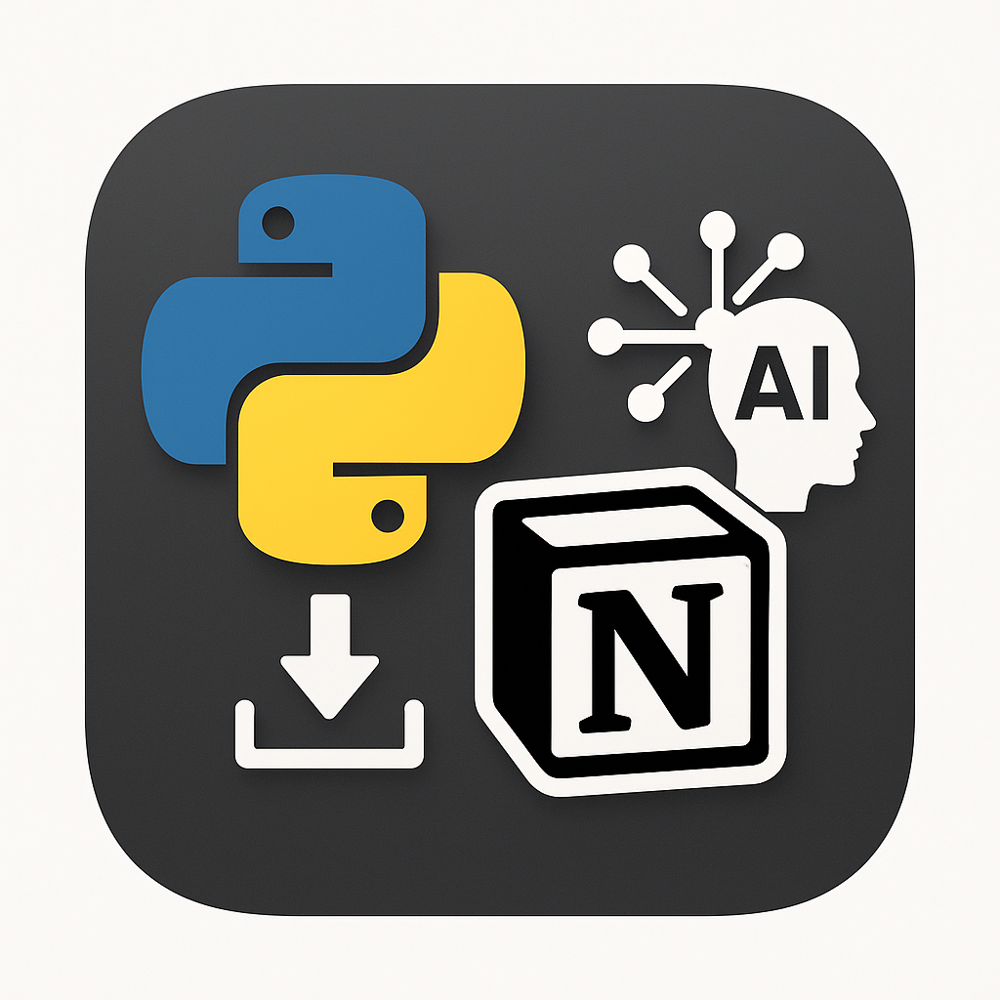

# NotiFetch - Notion データ取得・分析ツール



NotiFetchは、Notionのデータを技術知識なしで誰でも簡単に取得し、AI（Gemini）を使って分析できるデスクトップアプリケーションです。

## 🚀 特徴

- **簡単操作**: 技術知識不要でNotionデータを取得
- **多様なデータ形式**: ページとデータベース両方に対応
- **CSV/Excel出力**: データをCSVやExcelファイルとして保存
- **AI分析**: Gemini AIを使った自然言語でのデータ分析
- **セキュア**: APIトークンの暗号化保存
- **日本語対応**: 完全日本語インターフェース

## 📋 システム要件

- Windows 10/11
- Python 3.9以上
- インターネット接続（API通信用）

## 🛠️ インストール

### 1. リポジトリのクローン
```bash
git clone https://github.com/your-username/notifetch.git
cd notifetch
```

### 2. 仮想環境の作成
```bash
python -m venv venv
venv\Scripts\activate  # Windows
```

### 3. 依存関係のインストール
```bash
pip install -r requirements.txt
```

## 🔧 セットアップ

### 1. Notion API トークンの取得
1. [Notion Developers](https://developers.notion.com/)にアクセス
2. 新しいインテグレーションを作成
3. APIトークンをコピー
4. 対象のNotionページ/データベースにインテグレーションを招待

### 2. Gemini API キーの取得（オプション）
1. [Google AI Studio](https://makersuite.google.com/app/apikey)にアクセス
2. APIキーを生成
3. アプリケーションに設定

## 🚀 使用方法

### 1. アプリケーションの起動
```bash
python main.py
```

### 2. 基本的な使用手順
1. **接続設定タブ**でNotion APIトークンを入力
2. **接続テスト**でAPIの動作を確認
3. **ページ/データベースID**を入力して検証
4. **データ取得タブ**でデータを取得
5. **CSV/Excel**でデータをエクスポート
6. **AI分析タブ**でGemini APIキーを設定（オプション）
7. 自然言語でデータ分析を実行

## 📊 対応データ形式

### Notionページ
- 見出し（H1, H2, H3）
- 段落
- リスト（箇条書き、番号付き）
- To-doリスト
- コードブロック
- 引用
- コールアウト

### Notionデータベース
- タイトル
- リッチテキスト
- 数値
- 選択（単一・複数）
- 日付
- チェックボックス
- URL
- メール
- 電話番号
- ユーザー
- リレーション
- 数式
- ロールアップ

## 🤖 AI分析機能

### 自然言語クエリ例
- "このデータの傾向を教えて"
- "売上が最も高い月はいつですか？"
- "異常値や注目すべき点はありますか？"
- "データの品質に問題はありますか？"

### 自動洞察生成
- データの全体的な傾向分析
- 異常値の検出
- データ品質の評価
- ビジネス上の示唆の提供

## 📁 プロジェクト構造

```
notifetch/
├── main.py                 # アプリケーションエントリーポイント
├── requirements.txt        # 依存関係
├── README.md              # このファイル
├── todo.md                # 開発タスク管理
├── outline.md             # プロジェクト概要
├── src/
│   ├── config/            # 設定管理
│   │   ├── __init__.py
│   │   └── settings.py
│   ├── core/              # コアロジック
│   │   ├── __init__.py
│   │   ├── notion_client.py
│   │   └── gemini_client.py
│   ├── ui/                # ユーザーインターフェース
│   │   ├── __init__.py
│   │   └── main_window.py
│   └── utils/             # ユーティリティ
│       ├── __init__.py
│       └── data_converter.py
├── tests/                 # テストファイル
├── assets/                # アセット（アイコン等）
└── venv/                  # 仮想環境
```

## 🔒 セキュリティ

- APIトークンは暗号化してローカルに保存
- 設定ファイルはユーザーディレクトリに安全に保存
- ネットワーク通信はHTTPS経由のみ

## 📝 ログ

アプリケーションのログは以下の場所に保存されます：
- Windows: `%USERPROFILE%\.notifetch\logs\notifetch.log`

## 🐛 トラブルシューティング

### よくある問題

1. **Notion API接続エラー**
   - APIトークンが正しいか確認
   - インテグレーションがページに招待されているか確認

2. **ページが見つからない**
   - ページIDが正しいか確認
   - ページへのアクセス権限があるか確認

3. **Gemini API接続エラー**
   - APIキーが正しいか確認
   - APIの利用制限に達していないか確認

## 🤝 コントリビューション

1. このリポジトリをフォーク
2. 機能ブランチを作成 (`git checkout -b feature/amazing-feature`)
3. 変更をコミット (`git commit -m 'Add amazing feature'`)
4. ブランチにプッシュ (`git push origin feature/amazing-feature`)
5. プルリクエストを作成

## 📄 ライセンス

このプロジェクトはMITライセンスの下で公開されています。詳細は[LICENSE](LICENSE)ファイルを参照してください。

## 🙏 謝辞

- [Notion API](https://developers.notion.com/) - データ取得機能
- [Google Gemini](https://ai.google.dev/) - AI分析機能
- [PySide6](https://doc.qt.io/qtforpython/) - GUI フレームワーク
- [pandas](https://pandas.pydata.org/) - データ処理

## 📞 サポート

問題や質問がある場合は、[Issues](https://github.com/your-username/notifetch/issues)で報告してください。

---

**NotiFetch** - Notionデータを簡単に取得・分析 🚀 